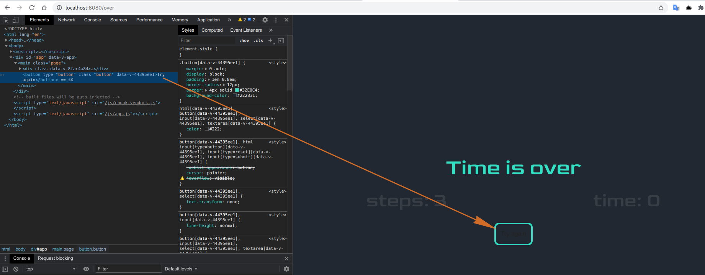

# Результати рев'ю/співбесіди

В цілому тестове написано непогано. Серйозних проблем з роботою гри немає, серйозних проблем у коді - мінімум. Детальніше по тестовому - нижче.

Але, судячи по результатам співбесіди - треба значно більше часу приділити саме вивченню javascript. Якщо добре знати основну мову програмування - розібратись з будь-яким фреймворком можна +- за тиждень.

Є гарний і безкоштовний ресурс з повним і детальним описом мови JS - https://learn.javascript.ru/. Але,просто прочитати і ознайомитись мало - знання треба закріплювати. Найпростіший спосіб - придумати 2-3 різнопланових завдання собі самостійно.. 1-2 гри щоб попрактикуватись із самою мовою, 1-2 сайти щоб потренуватись в роботі з бекендом і асинхронними данними (інтернет-магазин, сайт-каталог чи подібне). В якості тестового бекенду можна скористатись json-server (туторіали є в інтернеті)


## Зауваження по тестовому

- Не впевнений що це саме твоя помилка (а не програми-збірника).. Але після запуску `npm i` і `npm run serve` - на linux сервер падав з помилкою **Cannot find module 'vue-loader-v16/package.json'**. Лікується встановленням `vue-loader-v16` вручну (`npm i -D vue-loader-v16`).

- Файл `ResetButton.vue`. Не правильно зачиненний тег `<style>`: `</styles>` замість `</style>`. Із-за цього проект також не піднімався.

- в проекті не повинно бути файлів які не використовуються, наприклад `./test` (тут описаний тест компонента `HelloWorld`, якого уже немає в проекті) або `src/assets/logo.png` (це зображення використовувалось в компоненті `HelloWorld`).

- пусті опціональні секції в `src/store/index.js` краще видаляти. подробиці [тут](src/store/index.js).

- є декілька незначних багів. колір тексту 

- якщо перезавантажити сторінку "game over".. тут мабуть треба було поставити редирект на головну, якщо даних немає в store, або взагалі не користуватись роутером а зробити додаток односторінковим (тоді і папка `src/router` була б також не потрібною, як і сам пакет `vue-router`) 

- якщо гравець впорався, на сторінці "game over" повинен писатися час, який він витратив на проходження гри. зараз відображається час, який ще залишився до "time is over" 

- vuex. це зручна штука для збереження даних, але її store не варто перевантажувати.. в великих проектах з ним буде важче працювати, і важче щось знайти. запобігти цього можна наступним чином:
  1. якщо данні із store використовуються лише одним компонентом і ніде більше - ці данні не повинні зберігатися в vuex. Їх краще отримувати і оновлювати всередині самого компоненту
  1. якщо дані потрібні лише одному компоненту і його "дітям" - ці данні не повинні бути в vuex, а повинні міститися в головному компоненті і далі передаватись через `props`, ну або нагору через `scoped-slots` (лише в деяких випадках).

таким чином в твоєму vuex можна було тримати лише данні про таймер і кількість кроків, бо ці данні використовуються на декількох сторінках. інші данні могли спокійно існувати лише в `GamePanel.vue`. А якщо додаток не використовував би `vue-router` взагалі - у vuex не було б необхыдності.

- [src/store/cards/index.js](src/store/cards/index.js). усі картки одноманітні. їх можна було просто сгенерувати у циклі. приклад у файлі

- vuex модулі. їх використання це дуже добре, але головне не перестаратись.. модулі часто використовують щоб розгородити данні різних сторінок сайту, або декількох vue-додатків в межах одного сайту. Не критично, але і одного модуля тут би вистачило.

- `restoreSteps` не використовується в `src/components/Timer.vue`

- `time` повинен витягатися зі store в [src/components/Timer.vue](src/components/Timer.vue)

- якщо пишеш таймер - час краще звіряти з реальним часом на комп'ютері, тому що setTimeout не гарантує що код викличеться рівно через вказаний проміжок часу і твій таймер буде "відставати". або використовуй setInterval (якщо проміжки часу не будуть малі - інаше виконання іншиго коду заблокується). приклад прив'язки до реального часу:

```js
const second = 1000;
const maxTime = 60 * second; // 60 sec
const endTime = Date.now() + maxTime;

const countDown = () => {
  const nowTime = Date.now();
  const msToS = ms => Math.floor(ms / second);

  console.log(msToS(endTime - nowTime));

  if (nowTime <= endTime) {
    setTimeout(countDown, second);
  }
};

countDown();
```

- для пустих значень краще використовувати `null` замість `''`, а для логічних дразу виставляти `false` або `true`. Наприклад `isDisabled: false`.

- це поки що найбільше зауваження. маніпулювати dom-елементами на пряму - погано. все подібні маніпуляції повинні робитися тільки через vue. наприклад в методі [closeSelectedCards](src/components/GamePanel.vue).
